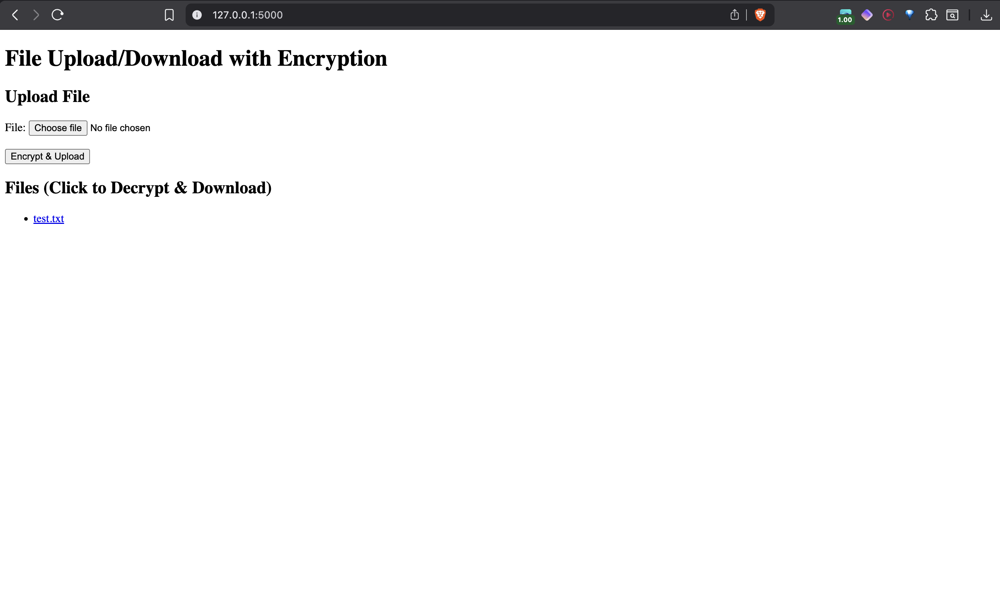

# Secure Mini Cloud MVP

A lightweight Flask-based web application for demonstrating secure file upload, encryption, and download. Files are encrypted client-side (using Fernet symmetric encryption) before storage and decrypted only during download. Ideal for a quick proof-of-concept on data privacy in a local "mini-cloud" setup—no databases, users, or external services required.

[](https://www.python.org/) [](https://flask.palletsprojects.com/) 


## Screenshot

*Simple interface for encrypting/uploading files and downloading decrypted originals.*

## Features
- **Secure Upload**: Encrypt files on-the-fly with AES-based Fernet before saving to disk.
- **File Listing & Download**: View encrypted files and decrypt/download originals with one click.
- **Data Isolation**: Encrypted blobs (`.enc` files) are unreadable without the key.
- **Minimalist UI**: Simple HTML form for upload; no JavaScript or styling bloat.
- **Local Demo**: Runs on `localhost`—perfect for testing encryption correctness.

## Tech Stack
- **Backend**: Flask (Python web framework)
- **Encryption**: `cryptography` library (Fernet for AES-128 + HMAC)
- **Package Management**: UV (fast pip alternative)
- **Frontend**: Vanilla HTML
- **Storage**: Local filesystem (`uploads/` dir)

## Quick Start

### Prerequisites
- Python 3.9+ installed
- Git (for cloning)

### Installation
1. **Clone the Repo**:
   ```bash
   git clone https://github.com/yourusername/secure-mini-cloud.git
   cd secure-mini-cloud
   ```

2. **Set Up Virtual Environment**:
   ```bash
   uv venv  # Creates .venv
   source .venv/bin/activate  # Mac/Linux; use .venv\Scripts\activate on Windows
   ```

3. **Install Dependencies**:
   ```bash
   uv pip install -r requirements.txt
   ```

4. **Generate Encryption Key** (One-Time Setup):
   ```bash
   python -c "from cryptography.fernet import Fernet; print(Fernet.generate_key().decode())"
   ```
   - Copy the output (e.g., `gAAAAAB...==`) and replace the placeholder in `app.py`:
     ```python
     KEY = b'your_generated_key_here'
     ```

5. **Run the App**:
   ```bash
   mkdir -p uploads templates  # Create dirs if missing
   uv run python app.py
   ```
   - Open [http://127.0.0.1:5000](http://127.0.0.1:5000) in your browser.

### Install from Scratch (No Repo)
If not using Git:
1. Create project dir: `mkdir secure-mini-cloud && cd secure-mini-cloud`
2. Copy `app.py` and `templates/index.html`.
3. Follow steps 2–5 above.

## Usage
1. **Upload a File**:
   - Select any file (e.g., `secret.txt` with content "Hello, encrypted world!").
   - Click "Encrypt & Upload".
   - File saves as `secret.txt.enc` (binary gibberish—verify manually!).

2. **View & Download**:
   - Page refreshes to show a list of files.
   - Click the filename (or button) to decrypt and download the original.
   - Test: Downloaded file should match the upload exactly.

3. **Verify Encryption**:
   - Open `uploads/secret.txt.enc` in a text editor—should be unreadable.
   - Wrong key? Decryption fails (app returns error).

Example Workflow:
- Upload `test.pdf` → List shows "test" → Download → Gets original PDF.

## Project Structure
```
secure-mini-cloud/
├── app.py              # Flask backend (routes, encryption logic)
├── templates/
│   └── index.html      # Simple upload/list UI
├── uploads/            # Encrypted files (ignored by Git)
├── requirements.txt    # Frozen deps
├── README.md           # This file
└── .gitignore          # Ignores venv, .enc, etc.
```

## Security Notes
- **Key Management**: Hardcoded key for demo—use env vars (e.g., `os.getenv('SECRET_KEY')`) in production.
- **Limitations**: No auth (local-only); fixed key exposes if code is shared. No file size limits or validation.
- **Best Practices**: For real use, add HTTPS, user sessions, and per-file keys.

## Troubleshooting
- **Key Error**: Regenerate and update `KEY` in `app.py`.
- **Downloads Fail**: Check server logs (terminal); ensure filename has no spaces.
- **Formatting Issues**: Ensure `README.md` is UTF-8; hard-refresh GitHub page.
- **Deps Missing**: Run `uv pip freeze > requirements.txt` to update.